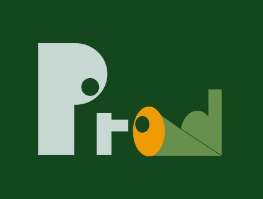

# ProdEye

<p align="center">
  
</p>

---

  

[](https://pycqa.github.io/isort/)

**ProdEye** - аппаратно-программная система визуальной верификации товаров для касс самообслуживания.
Система использует нейросетевую детекцию по видеопотоку с камеры для подтверждения того, что покупатель положил на весы именно тот товар, который был отсканирован по штрихкоду.

Проект предназначен для работы на мини-компьютерах, устанавливаемых непосредственно в каждую кассу самообслуживания.

---

## Содержание

- [Назначение системы](#назначение-системы)
- [Общий сценарий работы](#общий-сценарий-работы)
- [Архитектура решения](#архитектура-решения)
- [Структура проекта](#структура-проекта)
- [Конфигурация](#конфигурация)
- [Запуск](#запуск)
  - [Продакшн-режим](#продакшн-режим)
  - [UI-эмулятор](#ui-эмулятор)
- [Docker-окружения](#docker-окружения)
- [Обучение модели](#обучение-модели)

---

## Назначение системы

ProdEye добавляет **дополнительный уровень защиты от мошенничества** на кассах самообслуживания.

Система **не заменяет весы** и **не оценивает массу товара**.
Она выполняет **визуальное подтверждение соответствия** между:

- товаром, отсканированным по штрихкоду;
- товаром, фактически помещённым на весы.

---

## Общий сценарий работы

1. Покупатель сканирует товар по штрихкоду.
2. Покупатель кладет товар на весы.
3. Касса выполняет проверку соответсвия массы товара.
4. Касса отправляет событие о сканировании в ProdEye.
5. Камера фиксирует видеопоток в зоне весов.
6. Нейросетевой алгоритм детектирует объекты на кадрах.
7. Алгоритм верификации агрегирует детекции во времени.
8. Результат проверки возвращается в кассу:
   - `match` - товар подтверждён;
   - `mismatch` - обнаружено несоответствие;
   - `pending` - обаботка в процессе.
9. Исходя из результатов визуальной проверки, касса разрешает или запрещает следующую операцию.

**Примечание:** система не блокирует кассу напрямую, а передаёт результат для принятия решения кассовым ПО.

---

## Архитектура решения

Система построена по принципу гексагональной архитектуры.

Ключевые компоненты:

- **Camera** - источник видеокадров
- **CheckoutInput** - входной порт от кассы
- **Detector** - модель нейросетевой детекции товаров
- **Verifier** - логика принятия решения
- **CheckoutOutput** - передача результата в кассу
- **Pipeline** - оркестрация одного цикла проверки

## Структура проекта

```bash
ProdEye/
├── src/                # Основной код приложения
│   ├── adapters/       # Реализации портов
│   ├── app/            # Бутстрап, парсеры, фабрики, UI
│   ├── core/           # Бизнес-логика и пайплайн
│   ├── dataset_tools/  # Утилиты подготовки датасета
│   ├── exceptions/     # Пользовательские исключения
│   ├── utils/          # Дополнительные утилиты
│   ├── visualization/  # Утилиты визуализации
│   ├── main.py         # Главная точка входа приложения
│   └── ui_main.py      # Точка входа UI-эмулятора
│
├── configs/            # YAML-конфигурации компонентов
├── docker/             # Dockerfile для разных сред
├── requirements/       # Зависимости для разных сред
├── weights/            # Веса моделей
├── notebooks/          # Исследования и эксперименты
├── assets/             # Статические ресурсы
├── datasets/           # Датасеты для обучения модели
└── runs/               # Результаты обучения
```

---

## Структура проекта

Все компоненты системы настраиваются через YAML-файлы в каталоге `configs/`.

Каждый конфигурационный файл определяет:

- тип используемой реализации;
- параметры и пороговые значения;
- пути к ресурсам.

Пример конфигурации детектора c YOLO-детектором `(configs/detector.yaml)`:

```yaml
type: yolo

weights_path: weights/best.pt
device: cpu

thresholds:
  confidence: 0.2
  iou: 0.4

classes:
- apple
- cucumber
- grape
- kiwi
- lemon
- orange
- pear
- pineapple
- potato
- tomato
- watermelon
```

Для разработки и тестирования поддерживаются mock-реализации компонентов.

---

## Запуск

Проект запускается с использованием **docker-compose** и предполагает
комбинацию **двух compose-файлов**:

1. `docker-compose.base.yaml` — базовая конфигурация сервиса
2. Один из файлов, определяющих тип используемой камеры:
   - `docker-compose.host.yaml` — камера, подключённая к хосту
   - `docker-compose.net.yaml` — сетевая камера

---

### Продакшн-режим

Используется на реальной кассе самообслуживания **без UI-эмулятора**.

### 1. Камера, подключённая к хосту

```bash
docker compose \
  -f docker/prod/docker-compose.base.yaml \
  -f docker/prod/docker-compose.host.yaml \
  up -d
```

По умолчанию в контейнер монтируется устройство `/dev/video0`.
Указание другого видеоустройства происходит путем передачи параметра `VIDEO_DEVICE`:

```bash
VIDEO_DEVICE=/dev/video2 docker compose \
  -f docker/prod/docker-compose.base.yaml \
  -f docker/prod/docker-compose.host.yaml \
  up -d
```

Независимо от переданного параметра `VIDEO_DEVICE`, внутри контейнера камера
будет доступна как `/dev/video0`, поэтому в `configs/camera.yaml` необходимо указать:

```yaml
# configs/camera.yaml
source: 0
```

### 2. Сетевая камера

```bash
docker compose \
  -f docker/prod/docker-compose.base.yaml \
  -f docker/prod/docker-compose.net.yaml \
  up -d
```

Точка входа приложения:

```text
src/main.py
```

### UI-эмулятор

UI-эмулятор предназначен для разработки, отладки и демонстрации.

Для его корректного запуска необходимо указать в конфигурации:

```yaml
# configs/checkout_input.yaml
type: ui
```

```yaml
# configs/checkout_output.yaml
type: ui
```

### 1. Камера, подключённая к хосту

```bash
docker compose \
  -f docker/ui/docker-compose.base.yaml \
  -f docker/ui/docker-compose.host.yaml \
  up
```

### 2. Сетевая камера

```bash
docker compose \
  -f docker/ui/docker-compose.base.yaml \
  -f docker/ui/docker-compose.net.yaml \
  up
```

Точка входа UI-эмулятора:

```text
src/ui_main.py
```

Запуск UI-эмулятора также поддерживает явное указание видеоустройства путем передачи параметра `VIDEO_DEVICE`,
а также позволяет явно указать дисплей для отображения интерфейса эмулятора (по умолчанию указано `:0`):

```bash
DISPLAY=:1 docker compose \
  -f docker/ui/docker-compose.base.yaml \
  -f docker/ui/docker-compose.host.yaml \
  up
```

---

## Docker-окружения

| Окружение	| Назначение                                   |
|-----------|----------------------------------------------|
| prod	    | Минимальный образ для продакшн-развёртывания |
| ui	      | Образ с PyQt для UI-эмулятора                |

---

## Обучение модели

Обучение модели выполняется вне продакшн-окружения.

Необходимые зависимости для обучения моделей и работы с датасетами находятся
в `requirements/dev.txt`. (подтягивает зависимости из `requirements/base.txt`)

Соглашения по расположению директорий и файлов обучения:

- **Датасеты:** `datasets/`
- **Эксперименты и исследования:** `notebooks/`
- **Архитектуры моделей:** `src/models/`
- **Пайплайны обучения:** `src/training/`
- **Результаты обучения:** `runs/`
- **Итоговые веса:** `weights/`
